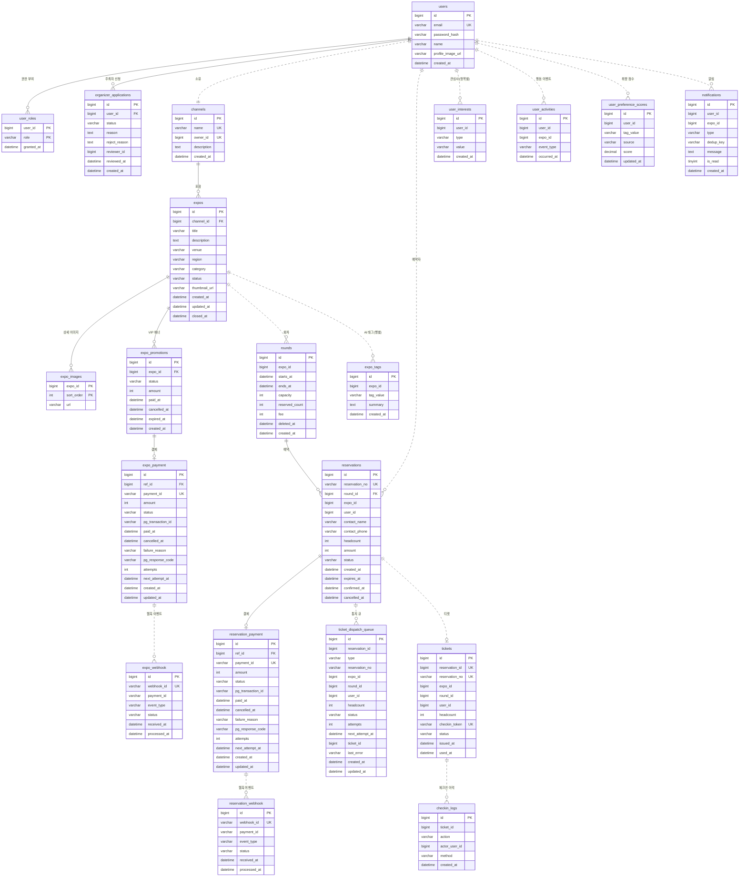

# ERD

# ERD 정의서

> **작성·동기화 메타정보**
> 
> 
> Notion 원본 URL: `https://app.notion.com/p/1-on-3c973873401a80eda868e11a916721b8`
> 
> Snapshot 기준 시점: `아직 없음 — Sprint 1 Review 종료 후 최초 동기화`
> 
> 동기화 시각: `아직 없음`
> 
> 직접 편집 금지: Git Snapshot은 직접 편집하지 않고 Notion 원본을 수정한 뒤 다시 동기화합니다.
> 
> 관련 업무 규칙: `요구사항정의서`
> 
> 데이터 소유권: `서비스경계`
> 

## Service별 모델

| Service | Table·Aggregate | 핵심 Column | 불변식·상태 | 근거 | 상태 |
| --- | --- | --- | --- | --- | --- |
| Identity-Service | users (Account Aggregate Root) | id PK, email UNIQUE, password_hash, name, profile_image_url, created_at | 이메일은 전체에서 유일하며 중복 가입은 거절된다. 동시 요청에서도 Unique 제약으로 한 건만 생성된다. 비밀번호는 단방향 저장하고 원문과 저장값을 응답·Log·문서에 노출하지 않는다. 전체관리자·주최자·회원이 같은 Table을 사용하며 부여 Role만 다르다. profile_image_url은 NULL 허용(미등록 시 NULL) | 시나리오 #1, #4 · 로그인/권한 규칙 | DONE |
| Identity-Service | user_roles (Account 종속) | user_id PK·FK→users.id, role PK, granted_at | role은 SUPER_ADMIN, ORGANIZER, USER로 제한하며 CHECK 제약으로 값을 강제한다. (user_id, role) 복합 PK로 중복 부여가 불가하다. 계정 생성과 Role 부여는 한 Transaction이며 실패 시 함께 Rollback한다. Role은 JWT 클레임으로 전달되어 다른 Service가 조회 없이 참조한다 | 시나리오 #1, #4 · 로그인/권한 규칙 · 대상 사용자 표 · 서비스 경계 데이터 소유권 | DONE |
| Identity-Service | organizer_applications (Account 종속) | id PK, user_id FK→users.id, status, reason, reject_reason, reviewer_id, reviewed_at, created_at | 주최자 권한 신청 1건당 1행. status 기본값 PENDING. user_id는 같은 Schema라 FK를 건다. reviewer_id(심사한 관리자)는 FK 없이 저장한다. reject_reason은 반려 시에만 채운다. 이미 ORGANIZER 이상이거나 PENDING 신청이 있으면 신청을 거절한다. 심사는 SUPER_ADMIN만 PENDING일 때 가능하며, 승인 시 ORGANIZER Role을 부여한다 | 주최자 신청·승인 규칙 | DONE |
| 박람회-Service | channels (Channel Aggregate Root) | id PK, name UNIQUE, owner_id UNIQUE 논리 참조, description, created_at | 채널명은 전체에서 유일하며 중복 생성은 거절된다. 한 주최자는 채널을 하나만 소유한다 — owner_id UNIQUE 제약과 서비스 계층의 existsByOwnerId 검사로 이중 보장하며, 서비스 검사만으로는 동시 요청 두 건이 나란히 통과할 수 있어 DB 제약이 최종 보장이다. owner_id는 identity.users.id를 논리 참조로 저장하고 Foreign Key를 만들지 않는다. 소유자만 채널과 하위 박람회를 조회·수정할 수 있으며 테넌트 격리의 기준점이다 | 시나리오 #1 · 채널(테넌트) 격리 규칙 | DONE |
| 박람회-Service | expos (Expo Aggregate Root) | id PK, channel_id FK→channels.id, title, description, venue, region, category, status, thumbnail_url, closed_at, created_at, updated_at | 상태는 HIDDEN → PUBLISHED → CLOSED로 전이하며, CLOSED에서는 어느 상태로도 되돌아갈 수 없다. 생성 직후는 항상 HIDDEN이다. HIDDEN → PUBLISHED는 소유 주최자만 전환하며, 회차가 하나도 없으면 거절한다. PUBLISHED → HIDDEN은 마지막 살아있는 회차가 삭제될 때 Reservation-Service의 요청으로 자동 전환된다 — 회차 0개인 공개 박람회가 생기지 않게 하는 역방향 보정이다. PUBLISHED → CLOSED는 모든 회차 종료 시각 경과 시 스케줄러(10분 주기)가 자동 전환하며, 조건부 UPDATE로 반복 실행해도 상태와 closed_at이 중복 변경되지 않는다. HIDDEN과 CLOSED는 방문자 목록·상세에 노출되지 않으나 소유 주최자는 조회할 수 있다. category는 IT·전자, 식품·음료, 패션·뷰티, 교육·취업, 문화·예술, 기타 6종으로 CHECK 제약을 건다. 소유 채널의 주최자만 수정할 수 있으며, 소개문·대표 이미지·상세 이미지·장소·지역·카테고리를 수정할 수 있고 channel_id와 status는 수정 대상이 아니다 | 시나리오 #2, #3, #9 · 공개 상태 관리 규칙 · 공개 상태 조회 규칙 | DONE |
| 박람회-Service | expo_images (Expo 종속) | expo_id PK·FK→expos.id, sort_order PK, url | 박람회 소개용 상세 이미지. 장수 제한이 없고 순서가 의미를 가지므로 별도 Table로 둔다. (expo_id, sort_order) 복합 PK이며 행 자체의 식별자는 두지 않는다(@ElementCollection 매핑). sort_order는 0부터 시작하며 화면에 이 순서대로 세로로 쌓인다. 박람회와 독립적으로 조회하지 않는다 | 시나리오 #2 · S9-4 상세 이미지 | DONE |
| 박람회-Service | expo_promotions (Expo 종속) | id PK, expo_id FK→expos.id, status, amount, paid_at, cancelled_at, expired_at, created_at | 신청 시 status=PENDING으로 생성되며, 결제 완료 웹훅 수신 후 ACTIVE로 전이되어 즉시 추천순 노출 대상이 된다. 재신청 시 기존 PENDING은 자동 취소된다. 동일 expo_id에 ACTIVE 상태는 동시에 1건만 존재한다. 노출 순번을 저장하는 컬럼을 두지 않는다. CLOSED 전환에 의한 노출 제외는 expos.status 조인으로 판단한다. 환불 시 status→CANCELLED, cancelled_at 기록, 즉시 노출 중단. 매일 00:00 스케줄러가 결제 후 30일 경과 또는 박람회 CLOSED인 ACTIVE 배너를 EXPIRED로 전환하고 expired_at을 기록한다(그 전까지 NULL) | 시나리오 #10 · VIP 배너 노출 규칙(개정) | DONE |
| 박람회-Service | payment_transactions (Payment 공용 모듈 소유) | id PK, ref_id FK→expo_promotions.id UNIQUE, payment_id UNIQUE, amount, status, pg_transaction_id, paid_at, cancelled_at, failure_reason, pg_response_code, attempts, next_attempt_at, created_at, updated_at | Reservation-Service의 동명 Table과 컬럼 구조가 같다. payment_id는 PortOne에 보내는 팀 접두사 포함 ID(BE24-01-{ULID})이며 UNIQUE. 상태는 PENDING, PAID, FAILED, REFUND_FAILED, CANCELLED로 CHECK. amount >= 0, attempts >= 0 CHECK. attempts·next_attempt_at은 환불 실패 재시도용이며 재시도 대상은 status = REFUND_FAILED로만 잡는다 | 시나리오 #10, #11 · 정산 집계 규칙 · 환불 규칙 | DONE |
| 박람회-Service | webhook_events (Payment 공용 모듈 소유) | id PK, webhook_id UNIQUE, payment_id 논리 참조, event_type, status, received_at, processed_at | webhook_id UNIQUE로 같은 웹훅의 재처리를 막는다. payment_id는 VARCHAR이며 payment_transactions.payment_id(PortOne ID)를 논리 참조한다 — FK를 걸지 않는다. status는 RECEIVED, PROCESSED, IGNORED로 CHECK. event_type 예: Transaction.Paid, Transaction.Cancelled | 시나리오 #10 · PG 연동 방식 규칙 | DONE |
| Reservation-Service | rounds (Round Aggregate Root) | id PK, expo_id 논리 참조, starts_at, ends_at, capacity, reserved_count, fee, deleted_at, created_at | expo_id는 논리 참조. capacity >= 1, fee >= 0, ends_at > starts_at CHECK 제약. CHECK (reserved_count >= 0 AND reserved_count <= capacity). reserved_count는 PENDING·CONFIRMED 예약 인원의 합이며 조건부 UPDATE로만 변경한다. 잔여 정원 = capacity - reserved_count. 수정·삭제는 reserved_count = 0일 때만. 삭제는 deleted_at 소프트 삭제(reservations.round_id FK 때문에 하드 삭제 불가, 취소·환불 이력 보존) | 시나리오 #2, #5, #6, #9 · 정원 관리 규칙 · 회차 수정·삭제 규칙 | DONE |
| Reservation-Service | reservations (Reservation Aggregate Root) | id PK, reservation_no UNIQUE, round_id FK→rounds.id, expo_id 논리 참조, user_id 논리 참조, contact_name, contact_phone, headcount, amount, status, created_at, expires_at, confirmed_at, cancelled_at | 상태는 PENDING → CONFIRMED / CANCELLED / EXPIRED로 CHECK. headcount >= 1, amount >= 0 CHECK. amount는 신청 시점 고정값(headcount × rounds.fee). reservation_no는 R-XXXX-XXXX 형식. contact_phone은 하이픈을 제거한 숫자만 저장. expires_at은 생성 +10분이며 EXPIRED 종료 시각을 겸한다. cancelled_at은 CANCELLED에만 채운다 | 시나리오 #5, #6, #8 · 정원 관리 규칙 · 예약 상태 전이 규칙 | DONE |
| Reservation-Service | payment_transactions (Payment 공용 모듈 소유) | id PK, ref_id FK→reservations.id UNIQUE, payment_id UNIQUE, amount, status, pg_transaction_id, paid_at, cancelled_at, failure_reason, pg_response_code, attempts, next_attempt_at, created_at, updated_at | 예약당 결제 1행. 상태는 PENDING, PAID, FAILED, REFUND_FAILED, CANCELLED로 CHECK. ref_id FK는 V4 시점에 reservations(V6)가 없어 V13에서 추가했다. ON DELETE 미지정(RESTRICT)으로 결제 기록이 있는 예약은 물리 삭제할 수 없다. payment_id는 PortOne ID로 UNIQUE. 환불 재시도 대상은 status = REFUND_FAILED로만 잡는다(환불 기한이 지나 PAID로 남는 취소 예약은 정상 상태) | 시나리오 #5, #6, #11 · 환불 규칙 · 정산 집계 규칙 | DONE |
| Reservation-Service | webhook_events (Payment 공용 모듈 소유) | id PK, webhook_id UNIQUE, payment_id 논리 참조, event_type, status, received_at, processed_at | webhook_id UNIQUE. payment_id는 VARCHAR로 payment_transactions.payment_id를 논리 참조하며 FK 없음(웹훅이 결제 행보다 먼저 도착하는 경우 대비). status는 RECEIVED, PROCESSED, IGNORED로 CHECK | 시나리오 #5, #10 · PG 연동 방식 규칙 | DONE |
| Reservation-Service | ticket_dispatch_queue (티켓 발급·무효화 재시도 큐) | id PK, reservation_id 논리 참조, type, reservation_no, expo_id, round_id, user_id, headcount, status, attempts, next_attempt_at, ticket_id, last_error, created_at, updated_at | (reservation_id, type) UNIQUE. type은 ISSUE / REVOKE로 CHECK. status는 PENDING / SUCCEEDED / GAVE_UP으로 CHECK. attempts >= 0, headcount >= 1 CHECK. reservation_id에 FK를 걸지 않는다. expo_id·round_id·user_id·headcount·reservation_no는 발송 시점 재조회를 피하려는 비정규화 값(reservation_no는 기존 행 때문에 NULL 허용). 확정과 같은 Transaction에 적재한다. REVOKE는 발급보다 재시도 상한을 더 길게 둔다 | 시나리오 #5, #7 · QR 발급·체크인 규칙 | DONE |
| Ticket-Service | tickets (Ticket Aggregate Root) | id PK, reservation_id UNIQUE 논리 참조, reservation_no UNIQUE, expo_id, round_id, user_id, headcount, checkin_token UNIQUE, status, issued_at, used_at | 예약당 티켓 1건. reservation_id UNIQUE로 멱등. headcount는 이 티켓이 대응하는 입장 인원. status: ISSUED / USED / CANCELLED. 예약 취소 시 CANCELLED(환불 여부 무관). USED인 티켓은 무효화 제외. reservation_no는 기존 행 때문에 NULL 허용(신규 발급은 애플리케이션이 강제) | 시나리오 #5, #7 · QR 발급·체크인 규칙 | DONE |
| Ticket-Service | checkin_logs (Ticket 종속) | id PK, ticket_id 논리 참조, action, actor_user_id 논리 참조, method, created_at | 체크인·되돌리기마다 1행. action: CHECK_IN / CANCEL, method: QR / RESERVATION_NO(화면이 보내지 않으면 NULL). 같은 Schema지만 FK를 걸지 않는다(이력은 티켓이 지워져도 남아야 함). 수정·삭제하지 않는다 | 시나리오 #7 · QR 발급·체크인 규칙 | DONE |
| recommendation-service | user_interests | id PK, user_id 논리 참조, type, value, created_at | 회원당 여러 행(관심사 항목당 1행). type은 CATEGORY / KEYWORD(VARCHAR, CHECK 없음). type=CATEGORY이면 카테고리 값, type=KEYWORD이면 키워드 값을 value에 저장. (user_id, type, value) UNIQUE. user_id는 identity.users.id 논리 참조. PUT /api/v1/me/interests 호출 시 기존 행 삭제 후 재삽입(전체 교체) | Story AI · AI 추천 규칙 | DONE |
| recommendation-service | user_activities | id PK, user_id 논리 참조, expo_id 논리 참조, event_type, occurred_at | 박람회 조회·예약·체크인 행동 기록. event_type은 PAGE_VIEWED / RESERVATION_CONFIRMED / CHECKED_IN(VARCHAR, CHECK 없음). (user_id, expo_id, event_type) UNIQUE이므로 같은 회원·박람회·이벤트 종류 조합은 1행만 남는다(반복 조회는 중복 적재되지 않음). 중복 이벤트는 무시하며 점수 재산정도 하지 않으므로 occurred_at은 최초 발생 시각이다. 삭제하지 않는다 | Story AI · 행동 데이터 수집 규칙 | DONE |
| recommendation-service | user_preference_scores | id PK, user_id 논리 참조, tag_value, source, score DECIMAL(10,4), updated_at | (user_id, tag_value, source) UNIQUE. source는 BEHAVIOR(행동) / INTEREST(관심사)로 점수 출처를 구분한다(VARCHAR, 기본값 BEHAVIOR). 행동 점수는 반감기 recency decay를 적용하며, 행동 이벤트 수신 시 해당 회원을 비동기로 즉시 재산정하고 매일 02:00에 전체를 배치로 재산정한다. 추천 목록 생성에 사용 | Story AI · AI 추천 규칙 | DONE |
| recommendation-service | expo_tags | id PK, expo_id 논리 참조, tag_value, summary TEXT, created_at | expo 공개 시 LLM이 자동 생성한 태그. 박람회당 여러 행(태그당 1행) — expo_id 단독 UNIQUE는 없고 (expo_id, tag_value) UNIQUE로 같은 태그 중복만 막는다. 재공개 시 기존 태그 삭제 후 재생성. LLM 실패 시 카테고리 기반 fallback 태그 사용 | Story AI · AI 추천 규칙 | DONE |
| recommendation-service | notifications | id PK, user_id 논리 참조, expo_id 논리 참조, type, dedup_key, message, is_read, created_at | 개인화 알림. type은 RECOMMENDATION·RESERVATION_CONFIRMED 등 알림 종류 구분(기본값 RECOMMENDATION). (user_id, dedup_key) UNIQUE로 같은 사건의 알림 중복 생성 방지 — 추천 알림은 RECOMMENDATION:{expoId}, 예약 확정 알림은 RESERVATION_CONFIRMED:{reservationId}. 예약 확정은 이메일 없이 이 앱 내 알림으로만 통지한다. is_read=false 건만 카운트해 뱃지 표시 | Story AI · 알림 규칙 | DONE |

## 물리 구성

| Schema | 소유 Service | Table | 상태 |
| --- | --- | --- | --- |
| identity | Identity-Service | users, user_roles, organizer_applications | DONE |
| expo | 박람회-Service | channels, expos, expo_images | DONE |
| expo | 박람회-Service | expo_promotions, payment_transactions, webhook_events | DONE |
| reservation | Reservation-Service | rounds | DONE |
| reservation | Reservation-Service | reservations, payment_transactions, webhook_events | DONE |
| reservation | Reservation-Service | ticket_dispatch_queue | DONE |
| ticket | Ticket-Service | tickets | DONE |
| ticket | Ticket-Service | checkin_logs | DONE |
| settlement | Settlement-Service | 없음 — 결제 레코드를 조회 시점에 집계하므로 자기 Table을 갖지 않는다 | DONE |
| recommendation | recommendation-service | user_interests, user_activities, user_preference_scores, expo_tags, notifications | DONE |

# ERD

**다이어그램 표기 규칙**

- **실선(`||--o{`)** 은 실제 Foreign Key, **점선(`||..o{`)** 은 FK 없는 논리 참조입니다(다른 Service DB 참조 + 같은 Schema지만 FK를 걸지 않은 경우).
- `expo_payment` 와 `reservation_payment` 는 표기상 분리일 뿐 실제 Table 이름은 둘 다 `payment_transactions`입니다.
- `reservation_webhook` / `expo_webhook`도 표기상 분리일 뿐 실제 Table 이름은 둘 다 `webhook_events`입니다. `payment_id`는 `payment_transactions.payment_id`(VARCHAR)를 가리킵니다.
- `checkin_logs.ticket_id`, `ticket_dispatch_queue.reservation_id`는 같은 Schema 안에 있지만 FK를 걸지 않습니다.
- recommendation-service 관계선은 모두 점선(논리 참조)입니다. `recommendation` Schema는 독립 DB이며 다른 Service DB에 FK를 걸지 않습니다.
- `user_interests`와 `expo_tags`는 user당/expo당 여러 행(항목당 1행)이므로 `||..o{` 관계입니다.

## 상태 전이

| 대상 | 전이 | 근거 업무 규칙 |
| --- | --- | --- |
| expos.status | HIDDEN → PUBLISHED(주최자, 살아있는 회차 1건 이상), PUBLISHED → HIDDEN(마지막 회차 삭제 시 자동), PUBLISHED → CLOSED(스케줄러 10분 주기 자동). 주최자가 PUBLISHED → HIDDEN으로 직접 되돌리는 전이는 없다. CLOSED에서 나가는 전이는 없다 | 공개 상태 관리 규칙, 공개 상태 조회 규칙, 회차 수정·삭제 규칙 |
| expo_promotions.status | PENDING → ACTIVE(웹훅 결제 완료), PENDING → CANCELLED(결제 취소·재신청 시 자동 정리), ACTIVE → CANCELLED(환불 시), ACTIVE → EXPIRED(매일 00:00, 결제 후 30일 경과 또는 박람회 CLOSED) | VIP 배너 노출 규칙(개정) |
| organizer_applications.status | PENDING → APPROVED(SUPER_ADMIN 심사, ORGANIZER Role 부여, reviewer_id·reviewed_at 기록), PENDING → REJECTED(reviewer_id·reviewed_at·reject_reason 기록) | 주최자 신청·승인 규칙 |
| reservations.status | PENDING → CONFIRMED(결제 승인), PENDING → CANCELLED(결제 실패·사용자 취소), PENDING → EXPIRED(결제대기 10분 만료), CONFIRMED → CANCELLED(사용자 취소, 단 체크인 완료 건은 제외) | 예약 상태 전이 규칙, 정원 관리 규칙, 예약 취소 가능 기간 규칙 |
| payment_transactions.status | PENDING → PAID, PENDING → FAILED, PAID → CANCELLED(환불 성공), PAID → REFUND_FAILED(환불 실패), REFUND_FAILED → CANCELLED(재시도 성공) | 환불 규칙, 정산 집계 규칙 |
| webhook_events.status | RECEIVED → PROCESSED(처리 완료), RECEIVED → IGNORED(처리 대상 아님) | PG 연동 방식 규칙 |
| tickets.status | ISSUED → USED(체크인), USED → ISSUED(체크인 되돌리기), ISSUED → CANCELLED(예약 취소). USED와 CANCELLED 사이의 전이는 없다 | QR 발급·체크인 규칙 |
| ticket_dispatch_queue.status | PENDING → SUCCEEDED(통지 성공), PENDING → GAVE_UP(최대 재시도 초과) | QR 발급·체크인 규칙 |
| notifications.is_read | false → true(사용자가 알림 읽음 처리). 되돌리지 않는다 | 알림 규칙 |

## Index

| Table | Index | 목적 | 상태 |
| --- | --- | --- | --- |
| users | email UNIQUE | 이메일 중복 가입 차단 | DONE |
| channels | name UNIQUE | 채널명 중복 생성 차단 | DONE |
| channels | owner_id UNIQUE | 주최자당 채널 1개 보장 + 자기 채널 조회 | DONE |
| expos | channel_id | 채널별 박람회 조회, 소유권 검증 | DONE |
| expos | (status, region, category) | 공개 목록 필터 조회 | DONE |
| expos | (status, closed_at) | 자동 마감 대상 조회 | DONE |
| rounds | expo_id | 상세 조회 시 회차 목록 | DONE |
| rounds | (expo_id, deleted_at) | 살아있는 회차만 조회 | DONE |
| rounds | starts_at | 날짜 필터·정렬 | DONE |
| rounds | ends_at | 자동 마감 대상 조회(모든 회차 종료 판정) | DONE |
| expo_promotions | (status, expo_id) | 추천순 목록 조회(status=ACTIVE 필터 + 순환 정렬) | DONE |
| reservations | reservation_no UNIQUE | 예약번호 중복 방지 | DONE |
| reservations | round_id | 회차별 예약 집계·명단 조회 | DONE |
| reservations | user_id | 본인 예약 목록 조회 | DONE |
| reservations | (status, expires_at) | 결제대기 만료 대상 조회 | DONE |
| payment_transactions | ref_id UNIQUE | 도메인 대상당 결제 1행 보장 | DONE |
| payment_transactions | payment_id UNIQUE | PortOne 결제 ID 중복 방지 + 웹훅 수신 시 조회 | DONE |
| payment_transactions | paid_at | 정산 매출 집계 기간 필터 | DONE |
| payment_transactions | cancelled_at | 정산 환불 차감 기간 필터 | DONE |
| payment_transactions | (status, next_attempt_at) | 환불 재시도 대상 조회 | DONE |
| tickets | reservation_id UNIQUE | 중복 발급 방지(멱등의 근거) | DONE |
| tickets | checkin_token UNIQUE | QR 스캔 조회 + 토큰 충돌 방지 | DONE |
| tickets | user_id | 본인 티켓 조회 | DONE |
| tickets | reservation_no UNIQUE | 예약번호 수동 체크인 조회 | DONE |
| checkin_logs | (ticket_id, created_at) | 티켓별 처리 이력 조회 | DONE |
| webhook_events | webhook_id UNIQUE | 같은 웹훅의 재처리 방지 | DONE |
| webhook_events | payment_id | 결제별 이벤트 조회 | DONE |
| ticket_dispatch_queue | (reservation_id, type) UNIQUE | 동종 작업 중복 적재 방지 | DONE |
| ticket_dispatch_queue | (status, next_attempt_at) | 배치 재시도 대상 조회 | DONE |
| user_interests | (user_id, type, value) UNIQUE | 동일 관심사 중복 방지 + 회원별 조회 | DONE |
| user_activities | (user_id, expo_id, event_type) UNIQUE | 중복 이벤트 적재 방지 | DONE |
| user_activities | user_id | 회원별 행동 조회 | DONE |
| user_activities | expo_id | 박람회별 행동 조회 | DONE |
| user_preference_scores | (user_id, tag_value, source) UNIQUE | 회원·태그·출처당 1행 보장 | DONE |
| user_preference_scores | user_id | 회원별 점수 조회 | DONE |
| expo_tags | (expo_id, tag_value) UNIQUE | 같은 박람회의 태그 중복 방지 | DONE |
| expo_tags | expo_id | 박람회별 태그 조회 | DONE |
| notifications | (user_id, dedup_key) UNIQUE | 중복 알림 방지 | DONE |
| notifications | user_id | 회원별 알림 목록·미읽음 카운트 | DONE |

## Migration 소유

**Service마다 V1부터 독립적으로 매깁니다.**

### identity-service (`identity`)

| 순서 | 파일 | 내용 | 소유 Story | 상태 |
| --- | --- | --- | --- | --- |
| V1 | V1__create_users.sql | users, user_roles, 제약·Index | Story 1 | DONE |
| V2 | V2__seed_super_admin.sql | SUPER_ADMIN 초기 계정 Seed | Story 1 | DONE |
| V3 | V3__constrain_user_role_values.sql | user_roles.role CHECK 제약 | Story 1 | DONE |
| V4 | V4__create_organizer_applications.sql | organizer_applications | 주최자 신청 | DONE |
| V5 | V5__add_profile_image_to_users.sql | users.profile_image_url | 프로필 이미지 | DONE |

### expo-service (`expo`)

| 순서 | 파일 | 내용 | 소유 Story | 상태 |
| --- | --- | --- | --- | --- |
| V1 | V1__create_channels.sql | channels | Story 1 | DONE |
| V2 | V2__create_expos.sql | expos | Story 2 | DONE |
| V3 | V3__constrain_expo_category.sql | expos.category CHECK 제약 | Story 2 | DONE |
| V4 | V4__unique_channel_owner.sql | channels.owner_id UNIQUE | Story 1 | DONE |
| V5 | V5__create_expo_promotions.sql | expo_promotions | Story 10 | DONE |
| V6 | V6__create_payment_transactions.sql | payment_transactions(배너 결제) | Story 10 | DONE |
| V7 | V7__create_webhook_events.sql | webhook_events | Story 10 | DONE |
| V8 | V8__add_refund_retry_columns.sql | payment_transactions.attempts·next_attempt_at, INDEX | Story 5 | DONE |
| V9 | V9__create_expo_images.sql | expo_images(상세 이미지) | Story 9 (S9-4) | DONE |
| V10 | V10__add_expired_at_to_promotions.sql | expo_promotions.expired_at | Story 10 | DONE |

### reservation-service (`reservation`)

> V2·V3은 결번입니다.
> 

| 순서 | 파일 | 내용 | 소유 Story | 상태 |
| --- | --- | --- | --- | --- |
| V1 | V1__create_rounds.sql | rounds | Story 2 | DONE |
| V4 | V4__create_payment_transactions.sql | payment_transactions(예약 결제) | Story 5 | DONE |
| V5 | V5__create_webhook_events.sql | webhook_events | Story 5 | DONE |
| V6 | V6__create_reservations.sql | reservations | Story 5 | DONE |
| V7 | V7__add_reserved_count_to_rounds.sql | rounds.reserved_count와 CHECK 제약 | Story 5 | DONE |
| V8 | V8__create_ticket_dispatch_queue.sql | ticket_dispatch_queue | Story 5 | DONE |
| V9 | V9__add_type_to_ticket_dispatch_queue.sql | type 컬럼, UNIQUE 변경 | Story 5 | DONE |
| V10 | V10__add_refund_retry_columns.sql | attempts·next_attempt_at, INDEX | Story 5 | DONE |
| V11 | V11__add_reservation_no_to_ticket_dispatch_queue.sql | reservation_no 컬럼 추가 | Story 7 | DONE |
| V12 | V12__add_deleted_at_to_rounds.sql | rounds.deleted_at(소프트 삭제), (expo_id, deleted_at) INDEX | Story 9 | DONE |
| V13 | V13__add_fk_payment_transactions_reservation.sql | payment_transactions.ref_id → reservations.id FK | Story 5 | DONE |

### ticket-service (`ticket`)

| 순서 | 파일 | 내용 | 소유 Story | 상태 |
| --- | --- | --- | --- | --- |
| V1 | V1__create_tickets.sql | tickets | Story 5 | DONE |
| V2 | V2__ticket_one_per_reservation.sql | headcount 컬럼, reservation_id UNIQUE | Story 5 | DONE |
| V3 | V3__add_reservation_no_to_tickets.sql | reservation_no + UNIQUE | Story 7 | DONE |
| V4 | V4__create_checkin_logs.sql | checkin_logs | Story 7 | DONE |

### settlement-service (`settlement`)

정산은 결제 레코드를 조회 시점에 집계하므로 자기 Table을 갖지 않습니다. Migration 없음.

### recommendation-service (`recommendation`)

| 순서 | 파일 | 내용 | 소유 Story | 상태 |
| --- | --- | --- | --- | --- |
| V1 | V1__create_user_interests.sql | user_interests, (user_id, type, value) UNIQUE | Story AI | DONE |
| V2 | V2__create_user_activities.sql | user_activities, user_id·expo_id Index | Story AI | DONE |
| V3 | V3__create_user_preference_scores.sql | user_preference_scores, (user_id, tag_value) UNIQUE | Story AI | DONE |
| V4 | V4__create_expo_tags.sql | expo_tags, 태그당 1행, (expo_id, tag_value) UNIQUE | Story AI | DONE |
| V5 | V5__create_notifications.sql | notifications, (user_id, expo_id) UNIQUE | Story AI | DONE |
| V6 | V6__add_type_and_dedup_key_to_notifications.sql | type·dedup_key 추가, UNIQUE를 (user_id, dedup_key)로 교체 | Story AI | DONE |
| V7 | V7__add_unique_to_user_activities.sql | (user_id, expo_id, event_type) UNIQUE 추가 | Story AI | DONE |
| V8 | V8__add_source_to_user_preference_scores.sql | source 컬럼 추가, UNIQUE를 (user_id, tag_value, source)로 교체 | Story AI | DONE |

## 미정 항목

| Sprint | 결정해야 할 것 | 상태 |
| --- | --- | --- |
| Sprint 1 | 스케줄러 실행 주기와 다중 Instance 환경에서의 중복 실행 방지 방법 | **해소 — 자동 마감 10분 주기(0 /10 * * * ). 분산 락 없이 단일 인스턴스로 운영하며, 조건부 UPDATE라서 중복 실행돼도 결과가 같다 |
| Sprint 3 | 주최자가 공개된 박람회를 직접 숨김으로 되돌릴 수 있는지 | 해소 — 불가. unpublish는 내부 API(마지막 회차 삭제 시 자동 전환)에서만 호출된다 |
| Sprint 3 | 예약 확정 이메일 통지를 이번 Release에 넣을지 | 해소 — 미포함. 앱 내 알림(notifications.type = RESERVATION_CONFIRMED)으로 대체 |
| Sprint 3 | user_preference_scores 재산정 스케줄러 주기(실시간 vs 배치) | 해소 — 둘 다 사용. 행동 이벤트 수신 시 해당 회원을 비동기로 즉시 재산정하고, 매일 02:00에 전체를 배치로 재산정한다. 반감기 decay 적용 |
| Sprint 3 | LLM 호출 실패 시 expo_tags 공백 허용 여부(fail-open) | 해소 — 공백 불허. Gemini 호출 실패 시 카테고리 기반 fallback 태그를 생성한다 |
| Sprint 4 | expo_promotions.expired_at 도입에 따른 status 값(EXPIRED 등) 추가 여부 | 해소 — PENDING, ACTIVE, CANCELLED, EXPIRED. 매일 00:00에 결제 후 30일이 지났거나 박람회가 CLOSED인 ACTIVE 배너를 EXPIRED로 바꾸고 expired_at을 기록한다 |
| Sprint 4 | user_activities UNIQUE로 반복 행동이 1행에 합쳐지는 것이 recency decay 계산 의도와 맞는지 | 해소 — 중복 이벤트는 무시하고 점수 재산정도 하지 않는다. occurred_at은 최초 발생 시각이다 (⚠️ 다시 본 박람회가 점수에 반영되지 않는 한계가 있음) |
| Sprint 4 | organizer_applications.status 값 목록(승인·반려 명칭) | 해소 — PENDING, APPROVED, REJECTED. PENDING일 때만 SUPER_ADMIN이 심사하고, APPROVED가 되면 ORGANIZER Role을 부여한다 |

## 관계 원칙

- Foreign Key는 같은 Service DB 안에서만 사용
- 다른 Service ID는 논리 참조
- 생성 시점 값이 필요하면 Snapshot 목적과 갱신 금지를 명시
- 모든 DATETIME 컬럼은 UTC 기준 값을 저장하고 표시 시점에 KST로 변환
- 공용 모듈이 제공하는 엔티티(`payment_transactions`)는 코드만 공유하고 Table은 각 Service가 자기 Schema에 Migration
- **소프트 삭제 컬럼(`deleted_at`)을 쓰는 Table은 읽는 지점을 두 갈래로 나눠 적용한다.** 미래 행동을 받는 경로는 필터하고, 과거 이력을 보여주는 경로는 필터하지 않는다
- recommendation-service 테이블은 모두 recommendation Schema 독립 DB에 위치하며 다른 Service가 직접 접근하지 않는다

## 변경 이력

| 버전·일자 | 변경 내용 | 관련 작업 |
| --- | --- | --- |
| v0.1 / 2026-09-01 | Sprint 1 범위 5개 Table 최초 작성 | Story 1, 2, 3, 4 |
| v0.2 / 2026-09-02 | rounds Service별 모델 행 추가, 논리 참조 정정, Migration Service별 분리 | Round가 Reservation-Service 소유 결정 반영 |
| v0.3 / 2026-09-04 | 정산 집계 방식 결정(조회 시점), PG 샌드박스 반영 | 업무 규칙 보강 |
| v0.4 / 2026-09-04 | VIP 배너 노출 규칙 개정, expo_promotions Table 신설 | Story 10 |
| v0.5 / 2026-09-07 | 실제 코드 대조 오류 정정, Sprint 2 반영 | Sprint 1 코드 대조 · Sprint 2 계약 확정 |
| v0.6 / 2026-09-11 | Sprint 2 구현 완료분 반영 | Sprint 2 D파트 코드 대조 |
| v0.7 / 2026-09-14 | tickets.status 실제 값으로 수정, Sprint 3 설계 반영, 미정 항목 해소·추가 | Sprint 3 착수 전 코드 대조 |
| v0.8 / 2026-09-14 | recommendation-service Sprint 3 설계 반영 — user_interests, user_activities, user_preference_scores, expo_tags, notifications Table 신설, ERD 다이어그램·물리 구성·Index·Migration recommendation-service 섹션 추가, 미정 항목 2건 추가 | Story AI (Sprint 3~4) |
| v0.9 / 2026-09-26 | recommendation-service Sprint 3~4 구현 완료 반영 — 실제 엔티티 구조 정정(expo_tags·user_interests 항목당 1행, user_preference_scores tag_value+source, user_activities event_type, notifications type+dedup_key). Migration V6~V8 추가. 상태 PLANNED→DONE | Sprint 3~4 코드 대조 |
| v1.0 / 2026-09-27 | dev 브랜치 Migration 전수 대조 — 누락 Table 추가(organizer_applications, expo_images), 누락 컬럼 추가(users.profile_image_url, expo_promotions.expired_at, payment_transactions.payment_id, ticket_dispatch_queue의 type·expo_id·round_id·user_id·headcount). FK 정정(reservation payment_transactions.ref_id·ticket_dispatch_queue.reservation_id는 FK 없음). webhook_events.payment_id 타입을 VARCHAR로 정정. 실제 없는 Index 삭제(user_activities.occurred_at, notifications (user_id, created_at)·(user_id, is_read)), expo_tags (expo_id, tag_value) UNIQUE로 정정, 누락 Index 추가. identity V4·V5, expo V9·V10 Migration 추가. 전 Table 상태 DONE으로 정리. 미정 항목 4건 추가 | dev 코드 대조 |
| v1.1 / 2026-09-27 | reservation payment_transactions.ref_id FK 추가(V13) 반영, 미정 항목 전부 해소 및 결정 내용 본문 반영(expo_promotions EXPIRED 전이, organizer_applications APPROVED/REJECTED 전이·신청 규칙, user_preference_scores source 값·재산정 방식, user_activities event_type 값·중복 처리, expos 스케줄러 주기·주최자 직접 숨김 불가, 예약 확정 앱 내 알림 대체) | PR #319 |