# 시퀀스

# 시퀀스 다이어그램

## Story 1 — 회원가입·로그인

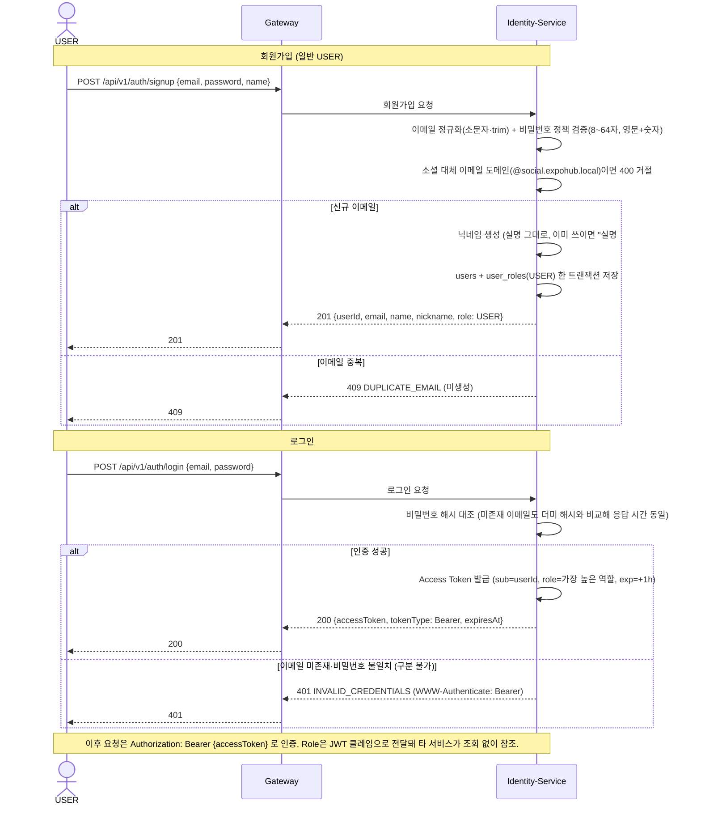

> Refresh Token은 미구현이다. Access Token(1시간) 만료 시 재로그인한다. 실명(`name`)은 바꿀 수 없고 겹쳐도 되며, 화면에 보이는 닉네임(`nickname`)만 유일하다. 소셜 로그인(구글·카카오·네이버) 흐름은 아래 “소셜 로그인” 절 참조.
> 

---

## Story 2 — 박람회 등록·회차 생성·공개

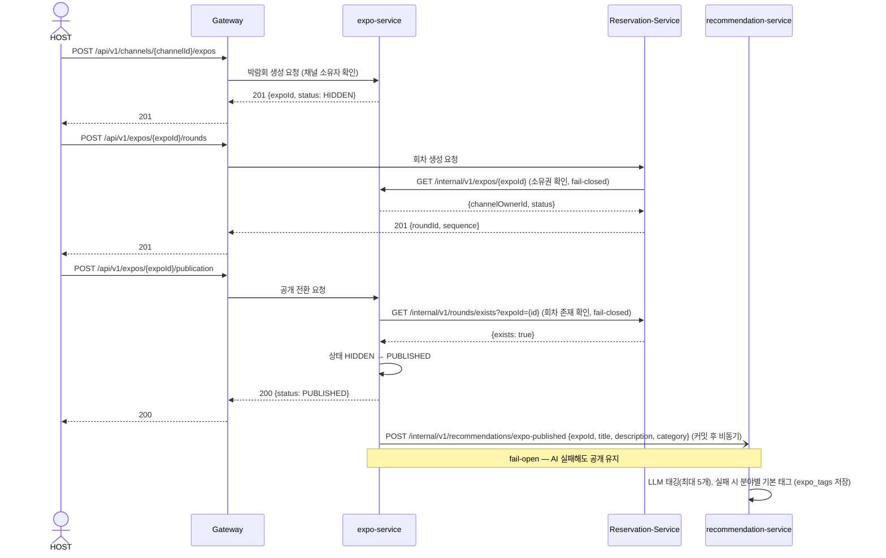

> 공개 중 제목·소개문을 수정하면 같은 방식으로 `POST /internal/v1/recommendations/expos/{expoId}/retag` 를 보내 태그를 다시 만든다.
> 

---

## Story 2-b — 회차 수정·삭제

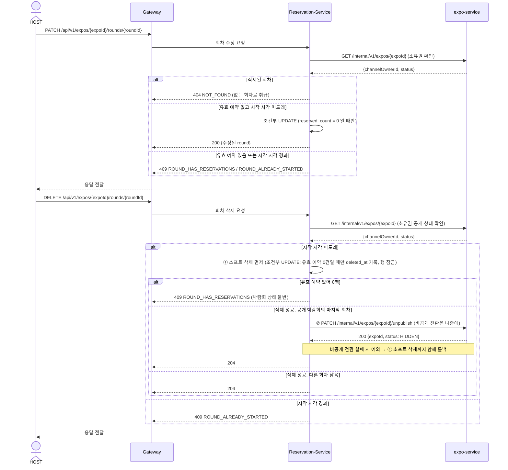

> 되돌릴 수 있는 로컬 삭제를 먼저, 되돌릴 수 없는 원격 비공개를 나중에 한다. 순서가 반대면 예약이 있어 삭제가 거절될 때마다 박람회만 숨겨진 채 남는다.
> 

---

## Story 5 — 예약·결제·QR 발급

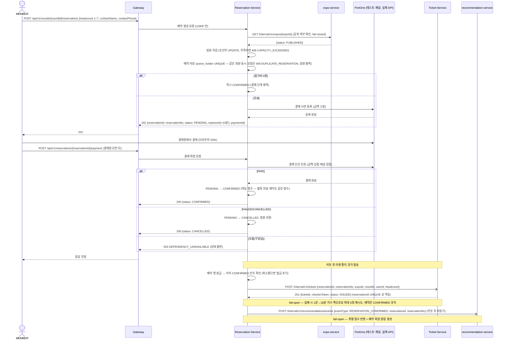

> PortOne 웹훅(`POST /api/v1/reservations/webhooks/portone`)도 같은 확정 함수를 탄다. 서명을 검증하고, 결제 결과를 알 수 없으면 503 을 주되 웹훅을 처리 완료로 적지 않아 재전송이 다시 처리된다. 결제대기 예약은 2분 주기 배치가 만료 시각(+10분)이 지난 건을 PG에 다시 조회해, 결제됐으면 확정하고 아니면 EXPIRED 로 정리한다.
> 

---

## Story 7 — 현장 체크인

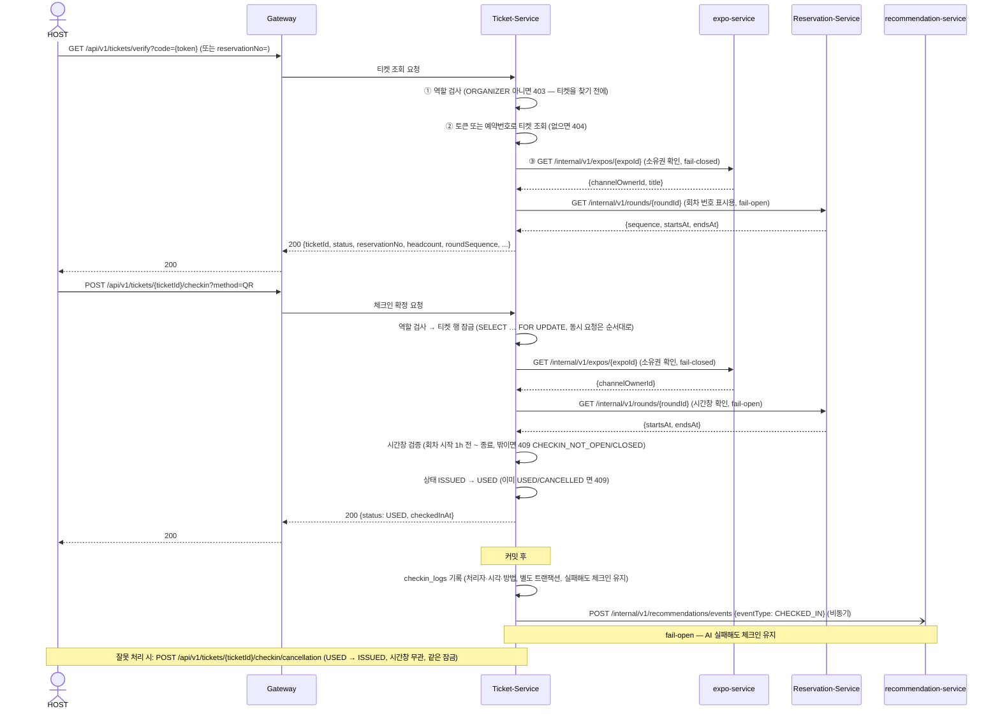

---

## Story 8 — 예약 취소·환불

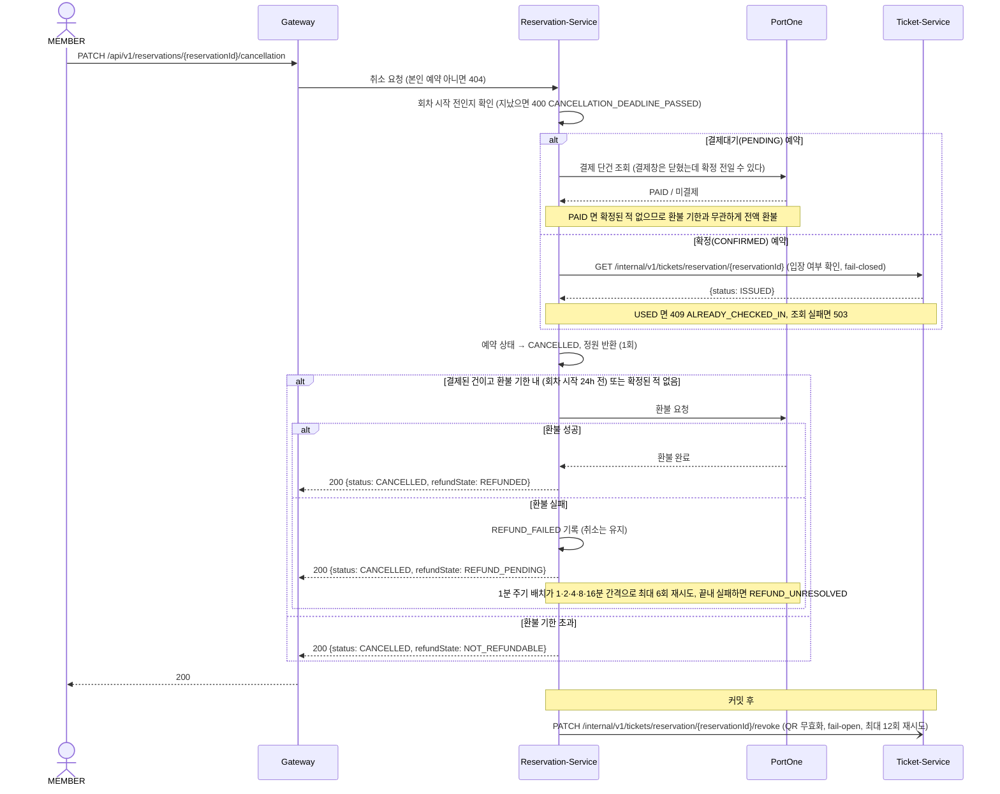

---

## Story 10 — VIP 배너 신청·결제

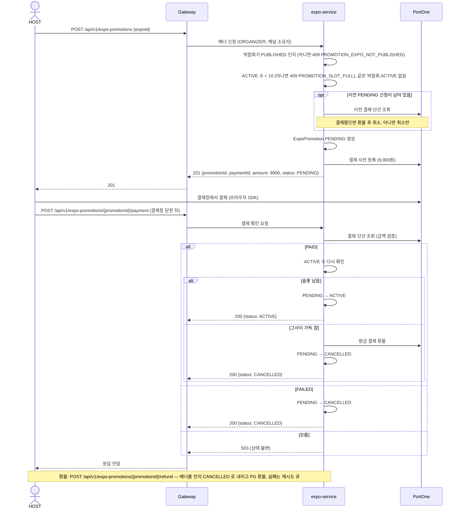

> PortOne 웹훅(`POST /api/v1/expo-promotions/webhooks/portone`)도 서명 검증 후 같은 확인 함수를 탄다. 활성 배너 조회(`GET /api/v1/expo-promotions/active`)는 ACTIVE 이면서 박람회가 PUBLISHED 인 것만 30초 단위로 순환해 돌려주고, 결제 후 30일 또는 박람회 마감은 매일 자정 배치가 EXPIRED 로 정리한다.
> 

---

## Story 11 — 정산 대시보드 조회

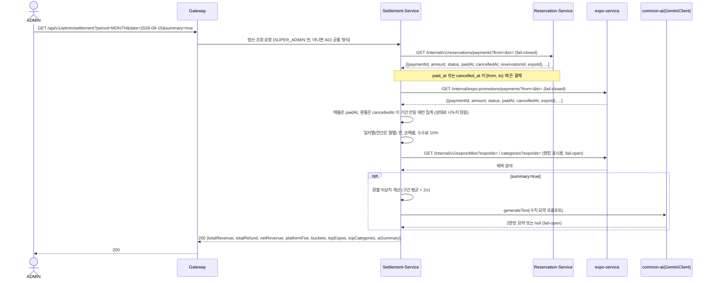

---

## Story AI — 맞춤 추천 조회 (Sprint 3~4 신규)

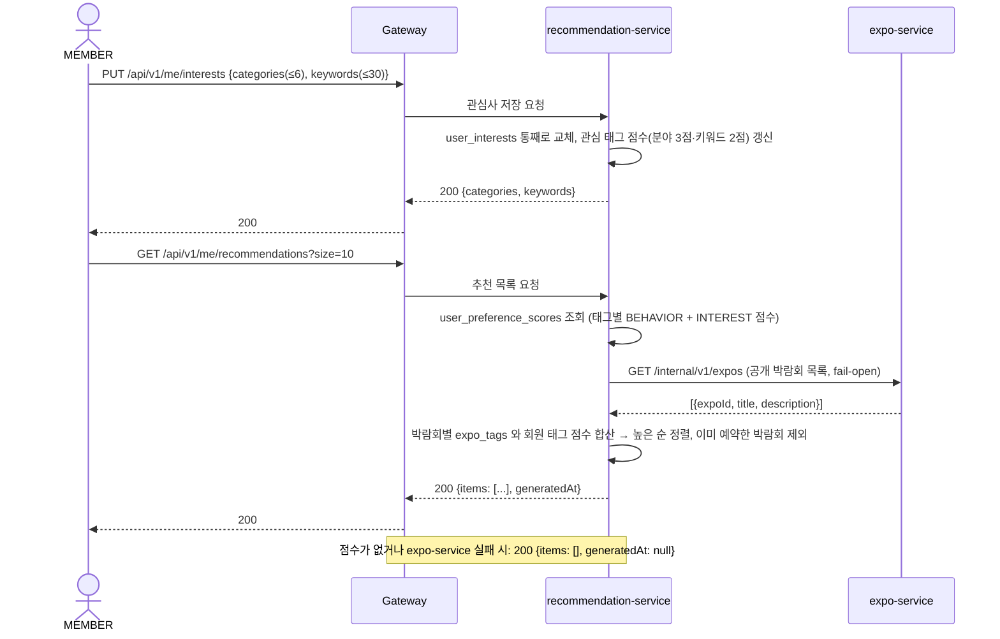

> 행동 점수는 이벤트 수신 시 비동기로, 매일 02시 배치로 다시 계산한다(체크인 5점·예약 확정 4점·상세 조회 0.5점, 30일 반감).
> 

---

## Story AI — 개인화 알림 발송 (Sprint 3~4 신규)

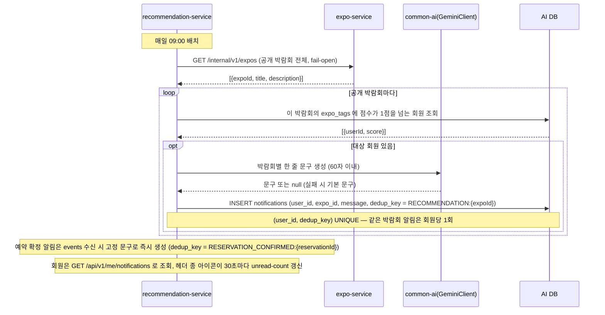

---

## AI 자연어 검색 (Sprint 4 신규)

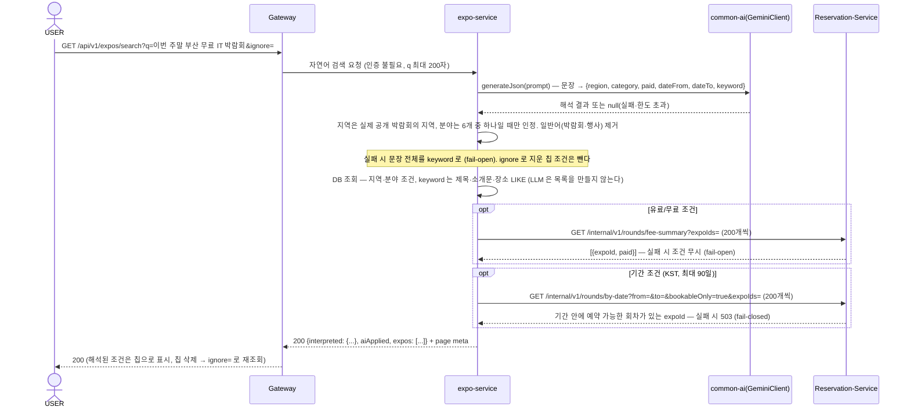

---

## AI 캘린더 일정 추천 (Sprint 4 신규)

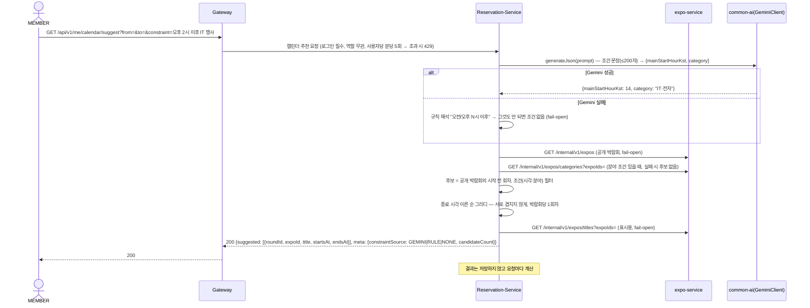

---

## AI 소개글 초안 생성 (Sprint 4 신규)

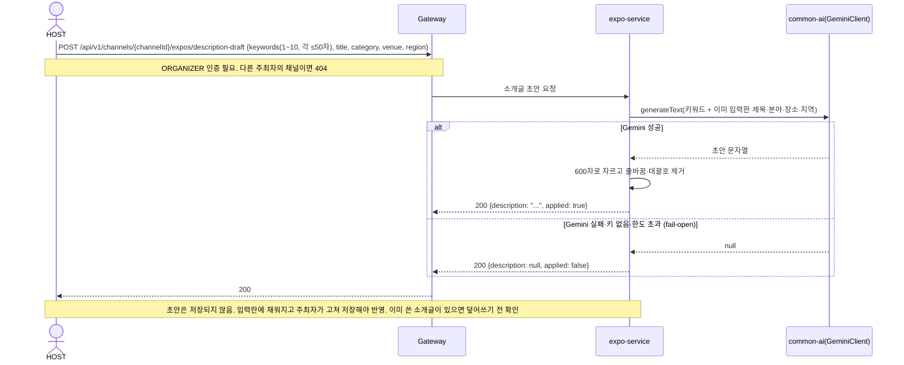

---

## 소셜 로그인 (Sprint 4 신규)

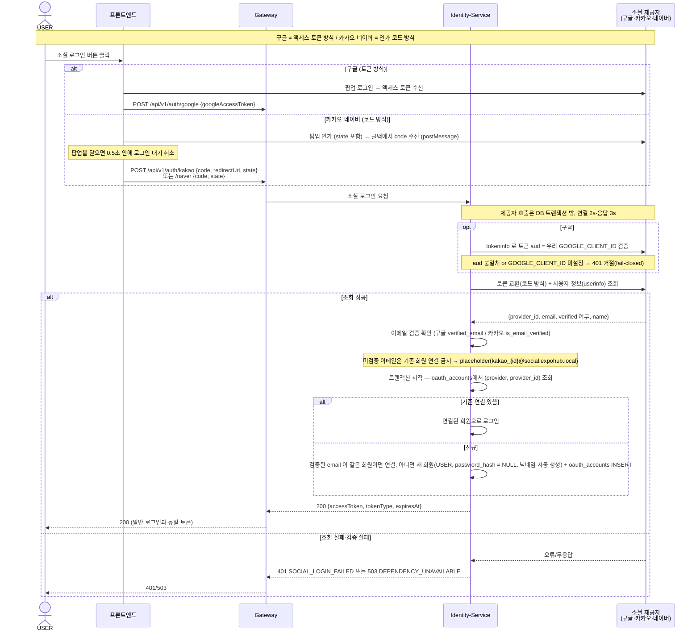

> 검증된 이메일만 기존 회원과 연결한다(#323). 미검증·무이메일은 placeholder(`@social.expohub.local`)로 처리하고, 이 도메인으로는 일반 가입도 막아 계정 연결 선점을 차단한다. 세 provider 모두 `(provider, provider_id)`가 oauth_accounts에 유일하게 저장되어 같은 소셜 계정이 두 회원에 붙지 않는다. 프론트는 카카오·네이버 인가 요청에 `state`(`crypto.randomUUID`)를 붙여 CSRF를 방지한다. 소셜 가입 회원은 `GET /users/me` 의 `hasPassword=false` 로 비밀번호 변경 화면이 숨겨진다.
> 

---

## 실패·복구 흐름

| 시나리오 | 실패 지점 | 처리 방식 |
| --- | --- | --- |
| 결제 요청 후 PG 응답 없음 | RS ↔︎ PG | 결제 확정 요청은 503(상태 불변). 2분 주기 배치가 만료 시각(+10분)이 지난 PENDING 을 PG에 다시 조회해 결제됐으면 확정, 아니면 EXPIRED 처리·정원 반환. PG 응답을 모르면 10분 유예 뒤 재시도 |
| 웹훅 수신 중 PG 조회 실패 | PG → RS/EX | 503 으로 재전송 요청. 웹훅 기록을 RECEIVED 로 남겨 재전송이 중복으로 걸러지지 않고 다시 처리된다 |
| QR 발급 실패 (Ticket-Service 불응답) | RS → TK | 커밋 후 큐에서 1·2·4·8·16분 백오프로 최대 6회 재시도 → 실패 시 예약 CONFIRMED 유지, QR 없음 표시. 재시도 전 예약이 취소됐으면 발급 포기 |
| QR 무효화 실패 | RS → TK | 취소는 완료, 무효화만 최대 12회(최대 1시간 간격) 재시도 — “취소된 예약으로 입장”이 발급 실패보다 나쁘므로 더 길게 |
| 환불 실패 | RS/EX → PG | 취소(배너는 내림)는 완료 처리, 환불만 1분 주기·최대 6회 배치 재시도. 전부 실패 시 REFUND_UNRESOLVED 로 남겨 운영자 수동 처리 |
| 결제대기 예약 취소 시 결제 여부 불명 | RS → PG | PG 단건 조회 결과가 “모름”이면 환불 없이 취소만 한다 (만료 배치가 뒤에 다시 확인) |
| 배너 켜는 순간 슬롯 초과 | EX | 방금 받은 결제를 환불하고 배너를 CANCELLED 로 둔다 |
| 체크인 중 Reservation-Service 불응답 (시간창 조회) | TK → RS | fail-open — 시간창 검증만 생략하고 체크인 허용, WARN 로그 기록 |
| 체크인 중 expo-service 불응답 (소유권 조회) | TK → EX | fail-closed — 503 반환, 체크인 거절 |
| 체크인 이력 기록 실패 | TK | 체크인은 유지(커밋 후 별도 트랜잭션), WARN 로그 |
| Settlement-Service에서 Reservation-Service·expo-service 불응답 | ST → RS/EX | fail-closed — 정산 조회 실패 응답 반환. 부분 합산 없음 |
| 자동 마감 스케줄러 중 Reservation-Service 불응답 | EX → RS | 이번 주기 건너뛰고 10분 뒤 재시도. 옛 버전과 섞여 커서가 전진하지 않으면 루프 중단 |
| recommendation-service 불응답 (박람회 태깅·재태깅) | EX → AI | fail-open — 무시, 태그 없는 상태로 공개 유지 (추천 매칭에서 해당 박람회 제외될 수 있음) |
| recommendation-service 불응답 (행동 이벤트) | RS/TK → AI | fail-open — 무시, 예약·체크인 정상 완료 (재시도 없음) |
| expo-service 불응답 (추천 목록·알림 배치) | AI → EX | 200 + `items: []` 반환 / 그날 추천 알림 건너뜀 |
| Gemini 실패 (자연어 검색) | EX → GeminiClient | fail-open — 문장 전체를 키워드로 검색 |
| Gemini 실패 (소개글 초안) | EX → GeminiClient | fail-open — 200 `{description: null, applied: false}` 반환 |
| Gemini 실패 (캘린더 제약 해석) | RS → GeminiClient | fail-open — 규칙 해석 → 조건 없이 그리디 실행 |
| Gemini 실패 (체크인 결과 요약·정산 요약) | TK/ST → GeminiClient | fail-open — 수치는 표시하고 요약만 null |
| 소셜 제공자 불응답 | ID → OP | 503 — 해당 제공자 로그인만 실패, 이메일 로그인 무영향. DB 커넥션을 잡지 않아 다른 요청에 영향 없음 |