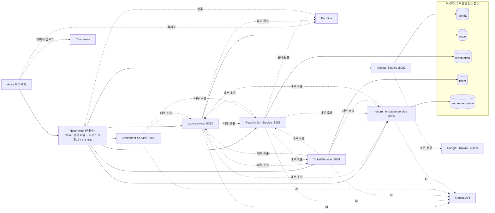

# 아키텍처

> 개정: v.17 / 2026-09-28 — `dev`(PR #331, `db06359`) 코드와 대조. `박람회-Service` → `expo-service`, 내부 호출선 정정(expo → ticket 추가), Identity 소유 데이터에 OauthAccount 추가, 소셜 로그인·Cloudinary·GHCR 외부 의존 추가, 스케줄러 주기·common-ai 수치·PG 연동 방식을 실제 값으로. 결정 기록의 "기각 사유 기입 필요" 를 채웠다.

## 현재 실행 구조

### 다이어그램 표기 규칙

- 실선은 외부 요청 라우팅과 자기 Schema 접근, 점선은 서비스 간 내부 호출(`/internal/**`, `Authorization: Bearer {INTERNAL_TOKEN}`)과 외부 API 호출입니다.
- DB는 MySQL 인스턴스 하나에 Service별 Schema 5개(identity, expo, reservation, ticket, recommendation)를 둡니다. 각 Service는 자기 Schema에만 접근하며, 다른 Schema를 가리키는 FK는 없습니다(`db/migration` 전수 확인).
- Settlement-Service는 DB가 없습니다. 조회 시점에 Reservation-Service·expo-service의 결제 기록을 내부 API로 가져와 집계합니다.
- 외부 요청의 `/internal/**`는 Nginx가 404로 차단합니다. Nginx는 JWT를 검증하지 않고, 각 Service가 common-security로 검증합니다.
- 브라우저가 직접 부르는 외부 서비스는 둘입니다. PortOne 결제창(SDK)과 Cloudinary 이미지 업로드(unsigned preset). 서버는 결과 주소·paymentId만 받습니다.
- 소셜 로그인은 Identity-Service가 제공자 API로 토큰·인가 코드를 검증합니다(구글은 `aud` 확인). 제공자 호출은 DB 트랜잭션 밖에서, 연결 2s·응답 3s 타임아웃.

### 배포 단위

| 단위 | 내용 |
| --- | --- |
| 컨테이너 | `mysql`, `identity-service`, `expo-service`, `reservation-service`, `ticket-service`, `recommendation-service`, `settlement-service`, `web` — 7개 + DB. `docker-compose.prod.yml`, 이미지는 GHCR(`ghcr.io/likelion-backend-24th/fpt1-*`) |
| 운영 | EC2 1대, `expohub.duckdns.org`, Let's Encrypt 인증서를 web 컨테이너가 종료. CD 는 GitHub Actions `workflow_dispatch` 로 수동 실행 |
| 로컬 | `docker compose up -d`(mysql·nginx) + IntelliJ 로 6개 서비스 + `npm run dev`(5173). PG 는 `portone-live` 프로필 없이 Mock, Gemini 는 키 없으면 폴백 |
| 비밀값 | `.env`·`application-local.yml`(gitignore) → GitHub Secrets → EC2 환경변수. `DB_ROOT_PASSWORD`, `JWT_SECRET`, `INTERNAL_TOKEN`, PortOne 키, `GEMINI_API_KEY`, `GOOGLE_CLIENT_ID`, 소셜 client secret. `VITE_*` 는 번들에 노출되므로 Cloudinary API Secret 은 절대 넣지 않는다 |

| Component | 책임 | 소유 데이터 | 관련 Story·계약 | 상태 | 추가·변경 Sprint |
| --- | --- | --- | --- | --- | --- |
| Nginx (web 컨테이너) | 프론트엔드(React/Vite) 정적 파일 서빙, 경로 기반 라우팅(`/api/v1/auth·admin·users·me/**`→identity, `me/interests·recommendations·notifications·views`·`expos/{id}/similar·tags`·`tags/bulk`→recommendation, `me/calendar·calendar`→reservation, `admin/settlement`→settlement, 나머지 `expos·channels·expo-promotions`→expo, `rounds·reservations`→reservation, `tickets`→ticket), HTTPS 종료(expohub.duckdns.org), `X-Trace-Id` 발급(`$request_id`), `/internal/**` 외부 비노출(404). 프론트와 API가 같은 Origin이라 CORS 설정 없음. `proxy_pass` 에 변수를 써서 재배포로 컨테이너 IP가 바뀌어도 재조회 | 없음 | 전체(Cross-cutting) | DONE | Sprint1, 라우팅 추가 Sprint3·4(#321) |
| Identity-Service | 회원가입·로그인(이메일 + Google·Kakao·Naver 소셜 로그인, `aud`·이메일 검증), JWT 발급(Access 1시간, Refresh 없음), 내 정보(닉네임·비밀번호·프로필 이미지 주소) 수정, 닉네임 가용성 조회, 주최자 권한 신청·심사(SUPER_ADMIN 승인/반려), 관리자 주최자 계정 발급 | User(실명 name + 유일 nickname), Role, OrganizerApplication, OauthAccount(소셜 계정 연결) | #1, #4 | DONE | Sprint1, 신청·마이페이지 Sprint3, 소셜·닉네임 Sprint4 |
| expo-service | 채널·박람회 등록/수정/공개/마감(자동 마감 스케줄러 10분, 커서 페이징), 상세 이미지 주소 관리, 목록(유료·무료 배지, 모집마감일순은 Reservation 에 위임)·자연어 검색, AI 소개글 초안, VIP 배너 신청·결제 확인·서명 웹훅·슬롯 재확인·환불·자정 만료, 주최자용 예약 현황(Reservation + Ticket 체크인 수 병합)·참가자 엑셀, 공개·수정 시 recommendation 에 태깅·재태깅 통지 | Channel, Expo(expo_images), ExpoPromotion, PaymentTransaction(배너), WebhookEvent(배너) | #1, #2, #3, #9, #10, AI-4, AI-5 | DONE | Sprint1, 배너 Sprint2·4, 검색·초안 Sprint4 |
| Reservation-Service | 회차(정원) 등록·수정(전체 교체)·소프트 삭제(마지막 회차면 expo 비공개, 실패 시 롤백), 회차 번호 파생, 예약 신청(DB UNIQUE 로 중복 방지)·조회·취소(PENDING 은 PG 선조회), 결제 확인·PortOne 웹훅, 결제대기 만료(2분 주기·유예 10분)·환불 재시도·티켓 통지 큐(1분 주기, 발급 전 예약 재확인) 스케줄러, 회차별 명단·요약, 정산용 결제 조회, 모집마감일순 정렬·기간 조건 회차 조회, 캘린더·AI 일정 추천(분당 5회) | Round, Reservation, PaymentTransaction(예약), WebhookEvent(예약), TicketDispatchQueue | #2, #5, #6, #8, AI-2 | DONE | Sprint1, 예약·결제 Sprint2, 수정·삭제 Sprint3, 캘린더 Sprint4 |
| Ticket-Service | 예약당 티켓 1건 발급(멱등)·무효화, 현장 체크인(QR/예약번호, 역할 검사 우선, 행 잠금)·시간창(시작 1시간 전~종료)·되돌리기, 체크인 이력, 회차별 체크인 집계, 체크인 결과 AI 요약 | Ticket, CheckinLog | #5, #7, AI-3 | DONE | Sprint2, 예약번호·시간창·되돌리기 Sprint3, 요약·동시성 Sprint4 |
| Settlement-Service | 예약·VIP 배너 결제 기록을 조회 시점에 사건 시각(`paidAt`·`cancelledAt`) 기준으로 집계(일·주·월·연, 매출·환불·플랫폼 수수료 10%), 박람회·카테고리 랭킹, 정산 기간 AI 요약(`summary=true` 일 때만), 관리자 정산 대시보드 API | 없음(조회 시점 집계) | #11, AI-6 | DONE | Sprint3, 사건 시각 기준·요약 Sprint4 |
| recommendation-service | 회원 관심사 관리, 행동 이벤트 수집(조회 0.5·예약 확정 4·체크인 5, 30일 반감기), 취향 점수 재산정(이벤트 즉시 + 매일 02:00 배치), 박람회 AI 자동 태깅·재태깅, 맞춤 추천·유사 박람회·태그 조회, 앱 내 알림(추천 매일 09:00, 예약 확정 즉시, 문구는 Gemini·실패 시 템플릿) | user_interests, user_activities, user_preference_scores, expo_tags, notifications | Story AI-1, `expo-published`·`retag`·`events` 내부 계약 | DONE | Sprint3, 점수·재태깅 Sprint4 |
| common-security | JWT 검증 필터(JwtAuthenticationFilter·JwtValidator), 인증 사용자 컨텍스트(AuthContext·AuthenticatedUser), 401 에 `WWW-Authenticate: Bearer`. 모든 Service가 사용 | 없음(코드만 소유) | 전체(Cross-cutting) | DONE | Sprint1 |
| common-payment | PaymentTransaction·WebhookEvent 엔티티, PG 클라이언트(`portone-live` 프로필이면 PortOneClient, 아니면 MockPgClient), 결제 사전등록·단건조회 검증·취소, 웹훅 서명 검증(PortOneWebhookVerifier, Raw Body)과 동기화(WebhookService — 결과 모르면 RECEIVED 유지), 환불 재시도 스케줄러(RefundRetryScheduler), Migration 템플릿. expo-service·Reservation-Service가 사용 | 없음(코드만 소유, Table은 각 Service Schema) | #5, #10, #11 | DONE | Sprint2, RECEIVED 유지 Sprint4 |
| common-ai | Gemini API 호출 공용 모듈. GeminiClient(기본 모델 `gemini-flash-latest`·설정으로 변경, `x-goog-api-key` 헤더, 5xx·429 재시도·4xx 미재시도, JSON 파싱 실패 시 null), AiCallBudget(서비스 인스턴스별 일일 한도 기본 1,000건, 기능별 카운트), AiResponseCache(LRU 500, TTL 6h), AfterCommitRunner, aiTaskExecutor(고정 4 thread). expo·Reservation·Ticket·Settlement·recommendation-service가 사용. 기능 이름 7개: expo-description, expo-search, calendar-constraint, notification-message, expo-tagging, checkin-report, settlement-summary | 없음(코드만 소유) | AI-1~AI-6 | DONE | Sprint4 |

## 결정 기록

| 결정 | 근거가 된 사용자 시나리오·위험 | 선택 | 검토 대안 | 결정 Sprint |
| --- | --- | --- | --- | --- |
| Round(회차·정원)를 Reservation-Service가 소유 | Release 성공 기준 "정원 초과 방지"(#5, #6) — 정원을 예약과 다른 서비스에 두면 hold 성공 후 예약 실패 시 정원이 허공에 뜨는 분산 트랜잭션 위험 | Round를 expo-service가 아닌 Reservation-Service 소유로 확정, 예약 생성·취소와 같은 DB 트랜잭션에서 원자적으로 처리. 회차 번호·모집마감일순·기간 조건 조회도 회차 시각을 가진 이 서비스가 계산 | expo-service가 Round 소유 + hold/release API 원격 호출 — Saga 보상 트랜잭션 설계가 필요해 1개월 일정에 과함, 기각 | v2(서비스 경계) |
| Ticket-Service 독립 유지 | 시나리오 #5(발급), #7(체크인) — 다른 도메인과 원자적 트랜잭션으로 묶여야 할 이유가 없음 | 독립 서비스로 유지. 예약 → 티켓은 통지 큐(fail-open)로, 티켓 → 예약·박람회는 조회만 | expo-service·Reservation-Service에 흡수 — 어느 쪽에 합쳐도 통신이 1~2개만 줄고 나머지는 남아 실익이 작아 기각 | v3(서비스 경계) |
| Settlement-Service 유지 + Pull 방식 | 시나리오 #11 — 이번 프로젝트 규모(테스트 트랜잭션 수준)라 실시간 이벤트 인프라가 필요한 부하 특성이 없음 | Settlement-Service는 별도 유지하되 자기 DB 없이, 조회 시점에 Reservation-Service(예약 결제)·expo-service(VIP 배너 결제)의 결제 기록을 내부 API로 Pull해 사건 시각 기준으로 집계 | 메시지 브로커로 실시간 이벤트 구독 — 1개월 일정에 인프라 부담이 커서 기각 | v3(서비스 경계), 사건 시각 기준은 Sprint4(#320) |
| 결제는 PortOne 실제 API의 테스트 채널로 연동 | 시나리오 #5, 강사님 질문("PG 연동키를 어디다 관리하나요?") — 정산은 PaymentTransaction 스키마만 보므로 결제 방식과 무관하게 동작함을 확인, 실제 연동 경험의 가치가 더 큼 | PortOne V2 실제 API를 테스트 채널로 호출해 사전등록·단건조회·취소·웹훅 흐름을 구현(`portone-live` 프로필). 로컬·CI 는 MockPgClient. 키는 `application-local.yml`(gitignore) → GitHub Secrets → EC2 환경변수 순으로 관리하고 어떤 문서·저장소에도 평문으로 두지 않는다. Reservation-Service·expo-service가 common-payment 를 통해 접근 | Mock 판정 결과(성공/실패)로만 처리 — 개발은 더 빠르지만 실제 연동 경험이 안 남고, 테스트 채널은 가맹점 심사가 필요 없어 개발 부담이 크지 않아 기각 | Sprint2 |
| 진입점을 Nginx 리버스 프록시로 단일화 | 백엔드가 6개 서비스로 늘어나면서 진입점을 하나로 모을 필요, 프론트 정적 파일도 같이 서빙해야 함 | Nginx(web 컨테이너)가 프론트 정적 파일 서빙·경로 라우팅·HTTPS 종료·Trace ID 발급·`/internal/**` 차단을 담당. 인증(JWT 검증)은 common-security 모듈로 각 서비스가 수행 | Gateway 없이 서비스별 직접 노출 — 인증·진입점 관리가 분산되어 기각. Spring Cloud Gateway(초기 계획, 빈 모듈로 존재) — 라우팅·HTTPS·정적 파일을 Nginx 가 이미 하고 있어 JVM 하나를 더 띄울 이유가 없고, 인증을 Gateway 에 모으면 내부 호출까지 같은 검증을 두 번 해야 해서 기각(PR #155 에서 모듈 삭제) | Sprint1, 삭제 Sprint2(#155) |
| Payment를 공용 Gradle 모듈로 분리 | 예약 결제(#5)와 VIP 배너 결제(#10) 둘 다 PG 연동이 필요해, 완전히 따로 구현하면 로직이 중복됨 | PaymentTransaction·WebhookEvent 엔티티·PG 클라이언트·상태 전이·서명 검증·환불 재시도는 common-payment 가 소유하고, 테이블은 모듈을 참조하는 각 서비스가 자기 Schema에 직접 Migration | 별도 Payment 마이크로서비스로 분리 — 결제 레코드를 한 서비스가 독점하면 "FK 는 같은 Service DB 안에서만" 원칙과 정산 조회 구조가 무너지고, 이번 규모엔 오버엔지니어링이라 기각 | Sprint2 |
| PortOne 웹훅 도입 | 사용자가 결제 후 브라우저를 닫으면 완료 API가 호출 안 될 수 있음(#5, #10) | 웹훅 수신 엔드포인트 + Raw Body 서명 검증을 결제 확정의 주경로로 두고, 사용자 호출·만료 배치 재확인을 같은 멱등 함수로 수렴. 결제 결과를 모르면 이벤트를 RECEIVED 로 남겨 PortOne 재전송을 받는다. 배너 웹훅은 Sprint4 까지 화면이 직접 호출했는데 서명 검증 경로로 통일하고 화면은 별도 결제 확인 API 를 부른다 | 스케줄러 폴링만 사용 — 반응 속도가 느리고 제출 체크리스트에 웹훅 항목이 명시. 스케줄러는 백업으로만 유지 | Sprint2, 배너 Sprint4(#321) |
| recommendation-service를 별도 서비스로 분리 | 추천·알림은 예약·결제와 변경 주기가 다르고, 추천 서비스 장애가 예약·체크인에 영향을 줘서는 안 됨 | recommendation-service(포트 8085) 독립 서비스 확정, 모든 연동 fail-open 이고 커밋 뒤에 보낸다 — recommendation-service가 죽어도 핵심 기능 무영향 | expo-service 내 모듈로 흡수 — 추천 기능이 확장될수록 expo 도메인과 결합도가 커져 기각 | Sprint3 |
| 추천 알고리즘 B안(규칙 기반 점수 + LLM 태깅) | 2주 일정 내 실현 가능성 확인 — 순수 LLM 호출은 레이턴시·비용 위험, 순수 규칙 기반은 태그 품질 한계 | 태그별 점수 집계(관심사 카테고리 3.0·키워드 2.0, 행동 조회 0.5·예약 4.0·체크인 5.0, 30일 반감기) + LLM은 태깅·요약·알림 문구 생성에만 한정. 후보는 항상 DB 조회 | 순수 LLM 실시간 추천 — 응답시간·비용 예측 불가로 기각 | Sprint3, 가중치 확정 Sprint4 |
| common-ai 공용 모듈 신설 | expo-service(자연어 검색·소개글 초안), reservation-service(캘린더 제약 해석), ticket-service(체크인 결과 요약), settlement-service(정산 기간 요약), recommendation-service(자동 태깅·알림 문구) 등 여러 서비스가 Gemini를 호출하면서 중복 구현 발생 | GeminiClient·AiCallBudget·AiResponseCache를 common-ai 모듈로 분리. API 키는 `x-goog-api-key` 헤더로만 전달해 URL·로그에 노출 방지. AI 호출은 모두 fail-open(키가 없거나 실패해도 규칙·템플릿·null 로 물러난다). 단 사용자가 명시한 조건(검색 기간·추천 카테고리)의 DB 조회 실패는 fail-closed | 각 서비스가 직접 Gemini 호출 — 예산·캐시 정책 중복 구현, 키 관리 분산 위험으로 기각 | Sprint4 |
| 소셜 로그인은 서버가 제공자에 검증, 미검증 이메일은 자리표시 계정 | 다른 앱에 발급된 구글 토큰으로 우리 서비스에 그 사용자로 로그인할 수 있고, 같은 이메일 자동 연결과 겹치면 기존 계정까지 넘어가는 위험(#318 검토) | 구글 tokeninfo 로 `aud` 확인(`GOOGLE_CLIENT_ID` 비어 있으면 전부 거부), `verified_email`·`is_email_verified` 확인, 미검증이면 `@social.expohub.local` 자리표시 이메일로 가입하고 그 도메인의 일반 가입·로그인을 막는다. 제공자 호출은 트랜잭션 밖 | 프론트에서 받은 이메일을 그대로 신뢰 — 계정 탈취 경로라 기각 | Sprint4(#323, #330) |
| 실명과 닉네임 분리 | 화면에 실명이 노출되고, 같은 이름 회원이 가입하면 구분이 안 됨 | `users.nickname` UNIQUE 추가(V8, 기존 회원은 `name#id` 로 백필), 가입 시 자동 생성, 마이페이지에서 변경. 화면은 닉네임만 표시 | 실명을 UNIQUE 로 — 동명이인 가입 불가라 기각 | Sprint4(#331) |

## 변경 이력

| 버전 | 일자 | 내용 |
| --- | --- | --- |
| v.16 | 2026-09-27 | common-ai 추가, 결정 기록에 recommendation·AI 항목 추가 |
| v.17 | 2026-09-28 | dev 최종 코드 대조 — expo-service 명칭, expo → ticket 내부 호출 추가, 브라우저 → PortOne·Cloudinary·소셜 제공자 외부 의존 추가, 배포 단위 표 신설, 각 Component 책임을 Sprint4 결과(사건 시각 정산·체크인 병합·배너 결제 확인·소셜·닉네임)로 갱신, Spring Cloud Gateway 기각 사유 기입, PG "샌드박스" 를 "실제 API 테스트 채널 + 로컬 Mock" 으로 정정, 결정 2건(소셜 검증·닉네임 분리) 추가 |
