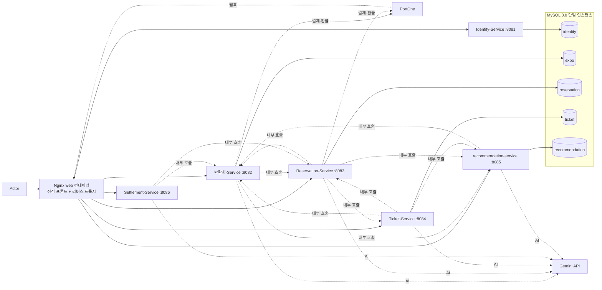

# 아키텍처

## 현재 실행 구조

### 다이어그램 표기 규칙

- 실선은 외부 요청 라우팅과 자기 Schema 접근, 점선은 서비스 간 내부 호출(`/internal/**`, `INTERNAL_TOKEN` 헤더 인증)과 외부 API 호출입니다.
- DB는 MySQL 인스턴스 하나에 Service별 Schema 5개(identity, expo, reservation, ticket, recommendation)를 둡니다. 각 Service는 자기 Schema에만 접근합니다.
- Settlement-Service는 DB가 없습니다. 조회 시점에 Reservation-Service·박람회-Service의 결제 기록을 내부 API로 가져와 집계합니다.
- 외부 요청의 `/internal/**`는 Nginx가 404로 차단합니다.

| Component | 책임 | 소유 데이터 | 관련 Story·계약 | 상태 | 추가·변경 Sprint |
| --- | --- | --- | --- | --- | --- |
| Nginx (web 컨테이너) | 프론트엔드 정적 파일 서빙, 경로 기반 라우팅, HTTPS 종료(expohub.duckdns.org), X-Trace-Id 발급($request_id), /internal/** 외부 비노출(404). JWT 검증은 하지 않고 각 Service가 common-security로 수행. 프론트와 API가 같은 Origin이라 CORS 설정 없음 | 없음 | 전체(Cross-cutting) | DONE | Sprint1 |
| Identity-Service | 회원가입·로그인(이메일 + Google·Kakao·Naver 소셜 로그인), JWT 발급, 내 정보(이름·비밀번호·프로필 이미지) 수정, 주최자 권한 신청·심사(SUPER_ADMIN 승인/반려), 관리자 주최자 계정 발급 | User, Role, OrganizerApplication | #1, #4 | DONE | Sprint1 |
| 박람회-Service | 채널·박람회 등록/수정/공개/마감(자동 마감 스케줄러), 상세 이미지, 목록·자연어 검색, AI 소개글 초안, VIP 배너 신청·결제·환불·만료, 주최자용 예약 현황·참가자 엑셀 다운로드(Reservation-Service 조회) | Channel, Expo(expo_images), ExpoPromotion, PaymentTransaction, WebhookEvent | #1, #2, #3, #9, #10 | DONE | Sprint1 |
| Reservation-Service | 회차(정원) 등록·수정·소프트 삭제, 예약 신청·조회·취소, 결제·환불(PortOne) 및 웹훅 처리, 결제대기 만료·환불 재시도·티켓 발급 통지 스케줄러, 회차별 참가자 명단·요약, 캘린더·AI 일정 추천(마감 임박 정렬) | Round, Reservation, PaymentTransaction, WebhookEvent, TicketDispatchQueue | #2, #5, #6, #8 | DONE | Sprint1 |
| Ticket-Service | 예약당 티켓 1건 발급·무효화, 현장 체크인(QR/예약번호)·되돌리기, 체크인 이력 기록, 체크인 현황·AI 요약 리포트 | Ticket, CheckinLog | #5, #7 | DONE | Sprint2 |
| Settlement-Service | 예약·VIP 배너 결제 기록을 조회 시점에 집계(매출·환불·수수료 10%), 카테고리·박람회 랭킹, 정산 기간 AI 요약, 관리자 정산 대시보드 | 없음(조회 시점 집계) | #11 | DONE | Sprint3 |
| recommendation-service | 회원 관심사 관리, 행동 이벤트 수집(조회·예약 확정·체크인), 취향 점수 재산정(이벤트 즉시 + 매일 02:00 배치), 박람회 AI 자동 태깅, 맞춤 추천·유사 박람회 목록, 앱 내 알림(추천 매일 09:00, 예약 확정) | user_interests, user_activities, user_preference_scores, expo_tags, notifications | Story AI (Sprint 3~4 신규), POST /internal/v1/recommendations/expo-published, POST /internal/v1/recommendations/events | DONE | Sprint3 |
| common-security | JWT 검증 필터(JwtAuthenticationFilter·JwtValidator), 인증 사용자 컨텍스트. 모든 Service가 사용 | 없음(코드만 소유) | 전체(Cross-cutting) | DONE | Sprint1 |
| common-payment | PaymentTransaction 엔티티, PortOne 클라이언트, 웹훅 서명 검증(PortOneWebhookVerifier), 환불 재시도 스케줄러, Migration 템플릿. 박람회-Service·Reservation-Service가 사용 | 없음(코드만 소유, Table은 각 Service Schema) | #5, #10, #11 | DONE | Sprint2 |
| common-ai | Gemini API 호출 공용 모듈. GeminiClient(기본 모델 gemini-flash-latest·설정으로 변경 가능, x-goog-api-key 헤더, 5xx·429·타임아웃 재시도), AiCallBudget(서비스 인스턴스별 일일 한도, 기본 1,000건, 기능별 카운트), AiResponseCache(LRU 500, TTL 6h), AfterCommitRunner, aiTaskExecutor(4-thread pool). 박람회·Reservation·Ticket·Settlement·recommendation-service가 사용 | 없음(코드만 소유) | AI-1, AI-2, AI-3, 자연어 검색 | DONE | Sprint4 |

## 결정 기록

| 결정 | 근거가 된 사용자 시나리오·위험 | 선택 | 검토 대안 | 결정 Sprint |
| --- | --- | --- | --- | --- |
| Round(회차·정원)를 Reservation-Service가 소유 | Release 성공 기준 “정원 초과 방지”(#5, #6) — 정원을 예약과 다른 서비스에 두면 hold 성공 후 예약 실패 시 정원이 허공에 뜨는 분산 트랜잭션 위험 | Round를 박람회-Service가 아닌 Reservation-Service 소유로 확정, 예약 생성·취소와 같은 DB 트랜잭션에서 원자적으로 처리 | 박람회-Service가 Round 소유 + hold/release API 원격 호출 — Saga 보상 트랜잭션 설계가 필요해 1개월 일정에 과함, 기각 | v2(서비스 경계) |
| Ticket-Service 독립 유지 | 시나리오 #5(발급), #7(체크인) — 다른 도메인과 원자적 트랜잭션으로 묶여야 할 이유가 없음 | 독립 서비스로 유지 | 박람회-Service·Reservation-Service에 흡수 — 어느 쪽에 합쳐도 통신이 1~2개만 줄고 나머지는 남아 실익이 작아 기각 | v3(서비스 경계) |
| Settlement-Service 유지 + Pull 방식 | 시나리오 #11 — 이번 프로젝트 규모(테스트 트랜잭션 수준)라 실시간 이벤트 인프라가 필요한 부하 특성이 없음 | Settlement-Service는 별도 유지하되 자기 DB 없이, 조회 시점에 Reservation-Service(예약 결제)·박람회-Service(VIP 배너 결제)의 결제 기록을 내부 API로 Pull해 집계 | 메시지 브로커로 실시간 이벤트 구독 — 1개월 일정에 인프라 부담이 커서 기각 | v3(서비스 경계) |
| 결제는 PG 샌드박스(테스트 모드) 연동 | 시나리오 #5, 강사님 질문(“PG 연동키를 어디다 관리하나요?”) — 정산(Settlement)은 PaymentTransaction 스키마만 보므로 결제 방식과 무관하게 동작함을 확인, 실제 연동 경험의 가치가 더 큼 | PG 샌드박스(테스트 모드) API로 실제 결제 승인·웹훅 흐름 구현. 키는 로컬 application-local.yml(.gitignore) → GitHub Secrets(CI/CD) → EC2 환경변수(운영) 순으로 관리, Reservation-Service·박람회-Service가 Payment 공용 모듈을 통해 접근(VIP 배너 결제도 같은 모듈 사용) | Mock 판정 결과(성공/실패)로만 처리 — 개발은 더 빠르지만 실제 연동 경험이 안 남고, 샌드박스는 가맹점 심사가 필요 없어 개발 부담이 크지 않아 기각 | Sprint2 |
| 진입점을 Nginx 리버스 프록시로 단일화 | 백엔드가 5개 이상 서비스로 늘어나면서 진입점을 하나로 모을 필요 | Nginx(web 컨테이너)가 프론트 정적 파일 서빙·경로 라우팅·HTTPS 종료·Trace ID 발급·/internal/** 차단을 담당. 인증(JWT 검증)은 common-security 모듈로 각 서비스가 수행 | Gateway 없이 서비스별 직접 노출 — 인증·진입점 관리가 분산되어 기각. Spring Cloud Gateway(초기 계획) — 최종적으로 Nginx 채택(기각 사유 기입 필요) | Sprint1 |
| Payment를 공용 Gradle 모듈로 분리 | 예약 결제(#5)와 VIP 배너 결제(#10) 둘 다 PG 연동이 필요해, 완전히 따로 구현하면 로직이 중복됨 | PaymentTransaction 엔티티·PG 클라이언트·상태 전이 로직은 공용 Gradle 모듈(common-payment)이 소유하고, 테이블은 모듈을 참조하는 각 서비스가 자기 Schema에 직접 Migration | 별도 Payment 마이크로서비스로 분리 — 이번 규모(4~5일 스프린트)엔 새 서비스 하나 더 만드는 오버엔지니어링이라 기각 | Sprint2 |
| PortOne 웹훅 도입 | 사용자가 결제 후 브라우저를 닫으면 완료 API가 호출 안 될 수 있음(#5) | 웹훅 수신 엔드포인트+서명검증을 결제 승인의 주경로로 추가, 기존 스케줄러 재확인(#77)은 백업으로 병행 | 스케줄러 폴링만 사용 — 반응 속도가 느리고 Project A 제출 체크리스트에 웹훅 항목이 명시 | Sprint2 |
| recommendation-service를 별도 서비스로 분리 | 추천·알림은 예약·결제와 변경 주기가 다르고, 추천 서비스 장애가 예약·체크인에 영향을 줘서는 안 됨 | recommendation-service(포트 8085) 독립 서비스 확정, 모든 연동 fail-open — recommendation-service가 죽어도 핵심 기능 무영향 | expo-service 내 모듈로 흡수 — 추천 기능이 확장될수록 expo 도메인과 결합도가 커져 기각 | Sprint3 |
| 추천 알고리즘 B안(규칙 기반 점수 + LLM 태깅) | 2주 일정 내 실현 가능성 확인 — 순수 LLM 호출은 레이턴시·비용 위험, 순수 규칙 기반은 태그 품질 한계 | 규칙 기반 점수 집계(recency decay 30일 반감) + LLM은 태깅·요약·알림 문구 생성에만 한정 사용, 키워드 6개 카테고리·20~30개 상세 | 순수 LLM 실시간 추천 — 응답시간·비용 예측 불가로 기각 | Sprint3 |
| common-ai 공용 모듈 신설 | expo-service(자연어 검색·소개글 초안), reservation-service(캘린더 제약 해석), ticket-service(체크인 결과 요약), settlement-service(정산 기간 요약), recommendation-service(자동 태깅·알림 문구) 등 여러 서비스가 Gemini를 호출하면서 중복 구현 발생 | GeminiClient·AiCallBudget·AiResponseCache를 common-ai 모듈로 분리. API 키는 x-goog-api-key 헤더로만 전달해 URL·로그에 노출 방지. AI 호출은 모두 fail-open(키가 없거나 실패해도 핵심 기능은 동작) | 각 서비스가 직접 Gemini 호출 — 예산·캐시 정책 중복 구현, 키 관리 분산 위험으로 기각 | Sprint4 |